# marca — skill de diseño de logos para Claude y agentes de IA

> **Fork en español** de [kaankiziltug/logo-design-skill](https://github.com/kaankiziltug/logo-design-skill), creado
> por [@kaankiziltug](https://github.com/kaankiziltug) y publicado con licencia [MIT](LICENSE). Todo el mérito del
> contenido original es suyo. Este fork traduce la skill completa al español (instrucciones, referencias, scripts y
> plantillas), la renombra `marca` y le agrega un cuestionario para darles identidad a agentes y proyectos.

[](https://github.com/crisio/logo-design-skill/actions/workflows/test.yml) [](#)


Una **skill de diseño de logos** completa que convierte a Claude —o a cualquier agente compatible con Agent Skills,
como Gemini CLI, Codex CLI, Cursor o GitHub Copilot— en un diseñador de identidad metódico, desde el primer brief
hasta los archivos SVG listos para producción y la guía de marca.

- **Principios y proceso**: descubrimiento y brief, mapa de palabras, elección del tipo de logo adecuado, conceptos,
  construcción geométrica, correcciones ópticas (compensación óptica u overshoot, efecto hueso, irradiación…), color,
  tipografía, composiciones (lockups), pruebas, presentación, entrega, rediseños y sistemas de identidad.
- **Una biblioteca de referencia con más de 1400 logos SVG reales**, cada uno clasificado visualmente por tipo de
  logo, técnica, geometría, tema, tipografía, tono e industria. Se consulta desde la línea de comandos y se explora en
  una galería local. Sirve para estudiar la construcción, conocer las convenciones de cada sector y evitar parecidos
  (nunca para copiar).
- **Herramientas en Python sin dependencias**: auditan un SVG según los principios de un buen logo; generan hojas de
  conceptos y hojas de pruebas (prueba de píxeles a 16 px, a una tinta, versión invertida, ojos entrecerrados, espejo,
  contextos, prueba de estantería contra la competencia); crean tableros de presentación para el cliente con mockups
  propios de cada industria; renderizan PNG y exportan el set completo de favicon, ícono de app y web manifest.

**Contenido:** [Cómo funciona](#cómo-funciona) · [Ejemplos](#ejemplos) · [Pruebas](#qué-detectan-las-pruebas) ·
[Instalación](#instalación) · [Uso](#uso) · [Qué incluye](#qué-incluye) · [Biblioteca](#la-biblioteca-en-cifras)

---

## Cómo funciona

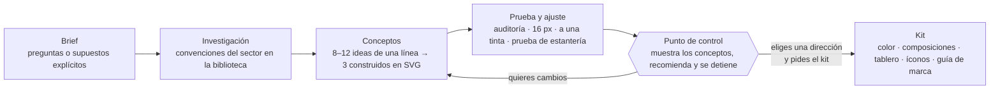

La skill siempre **se detiene en el punto de control**: muestra los conceptos en una sola imagen de conjunto, con una
recomendación, y ofrece el kit completo. No produce nada más hasta que eliges una dirección: el kit es la mayor parte
del trabajo y solo tiene sentido para una idea aprobada.

---

## Ejemplos

Dieciocho briefs ficticios, del lujo discreto y los festivales de neón al SaaS B2B, las fintech y la salud, cada uno
resuelto de principio a fin con la skill. Para cada marca ves exactamente lo que la skill muestra en el punto de
control (conceptos en escala de grises con tamaños reales de 64, 32 y 16 px y una recomendación), seguido de una vista
previa a color de la dirección elegida en mockups escogidos para esa industria. Las tandas más recientes apuestan a
propósito por **paletas vivas y saturadas**, sin dejar de pasar las pruebas a una tinta y de contraste 3 : 1. La
última tanda se mete con tres sectores muy concurridos: **SaaS** (sin globos de chat, gráficos ni candados),
**finanzas** (sin monedas, alcancías ni el típico azul de banco) y **salud** (sin cruces, pastillas ni líneas de
electrocardiograma).

Las imágenes vienen del proyecto original y están en inglés: las marcas conservan el nombre con el que aparecen en
ellas y, junto al nombre en español de cada concepto, va entre paréntesis el que se ve en la imagen.

| Marca | Sector | Estilo | Tipo de logo elegido |
|---|---|---|---|
| [Kiln](#kiln--tostador-de-café-de-especialidad) | Café de especialidad | Cálido, artesanal, moderno | Letra-símbolo + logotipo a medida |
| [Zestly](#zestly--app-de-comida-a-domicilio) | Comida a domicilio | Jugoso, pícaro, tomate y lima | Mascota |
| [Maison Orvelle](#maison-orvelle--atelier-de-moda-de-lujo) | Moda de lujo | Didona de alto contraste | Monograma |
| [Pulsewave](#pulsewave--festival-de-música-y-artes) | Festival de música | Neón sobre noche, cinético | Letra-símbolo abstracta |
| [Tinkertrail](#tinkertrail--talleres-stem-para-niños) | Educación STEM infantil | Lúdico, redondeado, multicolor | Letra-símbolo |
| [Ralli](#ralli--app-de-pádel-y-tenis) | App deportiva | Itálica dinámica, coral eléctrico | Letra-símbolo |
| [Alderpeak](#alderpeak--ropa-y-equipo-de-montaña) | Equipo de montaña | Robusto, slab serif, terroso | Símbolo pictórico |
| [Driftwell](#driftwell--hostal-de-surf-y-café) | Hotelería | Azulejo, colores vivos de costa | Emblema + símbolo |
| [Calmera](#calmera--clínica-de-fisioterapia) | Fisioterapia | Suave, orgánico, sereno | Símbolo pictórico |
| [Bramble Vet](#bramble-vet--clínica-veterinaria) | Veterinaria | Personaje amigable, soleado | Mascota |
| [Voltra](#voltra--energía-solar) | Energía limpia | Geométrico, naranja voltio | Símbolo abstracto |
| [Keyfort](#keyfort--gestor-de-contraseñas) | SaaS de seguridad | Retícula estricta, índigo eléctrico y menta | Símbolo abstracto |
| [Relaydesk](#relaydesk--saas-de-atención-al-cliente) | SaaS de soporte | Redondeado, violeta y coral | Símbolo abstracto |
| [Tracelane](#tracelane--analítica-de-producto) | Analítica para desarrolladores | Técnico, ácido y rosa sobre carbón | Letra-símbolo |
| [Tallybook](#tallybook--facturación-y-contabilidad) | Finanzas para pequeños negocios | Amigable, mandarina y verde azulado | Letra-símbolo |
| [Northvault](#northvault--banco-digital-para-freelancers) | Banca digital | Placa contundente, magenta intenso | Letra-símbolo |
| [Mediora](#mediora--app-de-telemedicina) | Telemedicina | Suave, cara coral sobre verde azulado | Mascota |
| [Brightdose](#brightdose--farmacia-en-línea) | Farmacia en línea | Amarillo soleado y cobalto | Letra-símbolo |

### Kiln — tostador de café de especialidad
*Tostador de lotes pequeños en Estambul: cálido, artesanal y moderno, sin caer en el cliché rústico. Debe funcionar en bolsas, vasos y como avatar de Instagram.*


**Recomendado: Horno** (*Kiln K* en la imagen) — una K cuya pierna es la boca arqueada de un horno (*kiln* en inglés); el arco reaparece como la *n* del logotipo. La auditoría detectó una diagonal de 60.8° en una primera versión de la *N* y un símbolo descentrado antes de mostrar nada.


### Zestly — app de comida a domicilio
*Cocinas locales independientes a domicilio en 25 minutos: fresco, rápido, apetitoso, pícaro. Sin tenedores, gorros de chef, motos ni pines de mapa.*


**Recomendado: Sonrisa** (*Big Grin* en la imagen) — una rodaja de cítrico volteada que se convierte en una sonrisa pícara que guiña un ojo: apetito y generosidad en un solo símbolo. Rojo tomate con cáscara verde lima y tinta berenjena. La skill también señala su riesgo con honestidad: hay quien ve la rodaja como una sandía.


### Maison Orvelle — atelier de moda de lujo
*Moda femenina de París, confección a medida y pequeña marroquinería: elegante, refinada, atemporal. Sin coronas, laureles ni degradados dorados.*


**Recomendado: Colgante** (*Pendant* en la imagen) — una M didona cuyo vértice sostiene una O como un colgante sobre un escote en V; se sigue leyendo a 16 px y es lo bastante sólida para grabarla en relieve sobre cuero. En la pasada de oficio se descartó una "LL" con pie compartido (se leía *ORVEILE*) y se evitó una M dentro de un círculo (demasiado parecida a un famoso cartel de transporte público).


### Pulsewave — festival de música y artes
*Festival de tres días de música electrónica y artes digitales junto a un lago: eléctrico, rítmico, eufórico. Sin barras de ecualizador, audífonos ni vinilos.*


**Recomendado: Focos** (*Crossing Beams* en la imagen) — dos luces de escenario lanzan cuatro haces que se van afinando; donde se cruzan los haces interiores dibujan la W, como brazos en alto, y pueden moverse al ritmo de la música. Magenta eléctrico, ultravioleta y cian sobre fondo nocturno. El cian solo llega a 1.5 : 1 sobre blanco, así que la skill lo reserva para fondos oscuros.


### Tinkertrail — talleres STEM para niños
*Talleres prácticos de robótica y circuitos que recorren escuelas: lúdico, curioso, confiable. Sin bombillas, átomos, engranajes ni cohetes.*


**Elegido: Poste** (*Signpost t* en la imagen) — la t es un poste indicador de sendero que lleva a los niños al siguiente descubrimiento: un fuste verde azulado (el sendero) y un letrero coral (lo que sigue). La skill había recomendado el concepto Caracol (*Workshop Snail* en la imagen), pero en el punto de control el cliente eligió la letra-símbolo porque aguanta mejor el uso en escuelas y se lee a 16 px. Justo para eso sirve el punto de control.


### Ralli — app de pádel y tenis
*Reserva canchas, encuentra compañeros de tu nivel y únete a ligas: enérgico, social, deportivo. Sin pelotas de tenis, raquetas cruzadas, trofeos ni trazos tipo swoosh.*


**Recomendado: Rebote** (*Rally R* en la imagen) — un solo trazo en itálica sube, pasa por arriba, vuelve y se aleja, como un peloteo; la pierna se ajustó a 60° exactos. Coral eléctrico sobre la tinta oscura de una cancha nocturna, con verde lima ácido reservado para fondos oscuros.


### Alderpeak — ropa y equipo de montaña
*Mochilas, chaquetas impermeables y capas base del noroeste del Pacífico: robusto, fiable, honesto. Nada de la típica montaña con sol.*


**Recomendado: Hito** (*Cairn* en la imagen) — tres piedras apiladas forman a la vez una cumbre, un pico y un hito de sendero; los huecos inclinados zigzaguean como un camino de montaña en curvas cerradas. Descartados en el camino: una *a* en forma de mosquetón (se leía como "cl") y contornos de anillos de árbol (se leían como una diana).


### Driftwell — hostal de surf y café
*Hostal de surf y café con diseño cuidado en la costa portuguesa: soleado, relajado, sociable. Sin palmeras, atardeceres ni siluetas de tablas de surf.*


**Recomendado: Azulejo** (*Azulejo Tile* en la imagen) — un azulejo portugués de los que llevan el nombre de la casa, con una D en el centro; puestos borde con borde, los cuartos de las esquinas se unen y forman soles. Azul Atlántico, mandarina y amarillo sol. La auditoría ajustó las diagonales de la W y la R a 75° y 45° exactos.


### Calmera — clínica de fisioterapia
*Rehabilitación, fisioterapia deportiva y pilates: sereno, cercano, profesional. Sin cruces, latidos, columnas vertebrales ni manos con corazones.*


**Recomendado: Garza** (*Still Heron* en la imagen) — una garza que se equilibra sobre una pata en agua quieta; el equilibrio en una pierna es un ejercicio clásico de rehabilitación y pilates, y nada en el sector se le parece. Una primera idea abstracta se descartó cuando la prueba de pares mostró que se parecía demasiado a una marca existente, y el verde salvia se oscureció para llegar a un contraste de 3 : 1.


### Bramble Vet — clínica veterinaria
*Veterinaria familiar para gatos y perros: cálida, confiable, alegre. Sin huellas, huesos, cruces ni estetoscopios.*


**Recomendado: Orejas** (*Odd Ears* en la imagen) — una cara sonriente con una oreja puntiaguda de gato y una oreja caída de perro: aquí caben todos los gatos y todos los perros. Cobalto y mora sobre amarillo soleado. Varias ideas se descartaron cuando la prueba de lectura las convirtió en uvas, un ancla o una tetera.


### Voltra — energía solar
*Paneles solares en el techo, baterías para el hogar y una app de energía: luminoso, optimista, fiable. Sin rayos de sol, hojas, relámpagos ni enchufes.*


**Recomendado: Acople** (*Sun Dock* en la imagen) — el sol se acopla a una batería con la forma justa para sostenerlo, y el hueco entre ambos es una luna creciente: *sol, también de noche*. Naranja voltio con azul marino nocturno. Se descartó una "o con nivel de carga" porque se leía *veltra*.


### Keyfort — gestor de contraseñas
*Gestor de contraseñas y SaaS de seguridad para equipos, con bóvedas compartidas, passkeys y control de acceso: seguro, sereno, sólido. Sin candados, escudos, ojos de cerradura, huellas dactilares ni eslabones de cadena.*

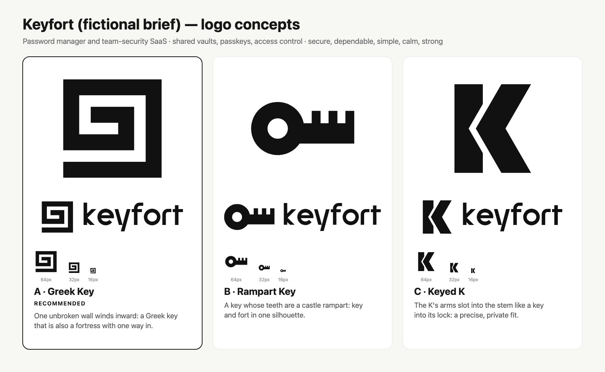

**Recomendado: Greca** (*Greek Key* en la imagen) — un solo muro continuo se enrolla hacia dentro: una greca clásica que también es una fortaleza con una única entrada. El índigo eléctrico la separa de los azules celestes del sector; la vuelta más interna se enciende en menta solo sobre índigo y superficies oscuras, porque la menta apenas llega a 1.4 : 1 sobre blanco. Se descartó la idea de un fuerte en estrella porque se leía como un shuriken.

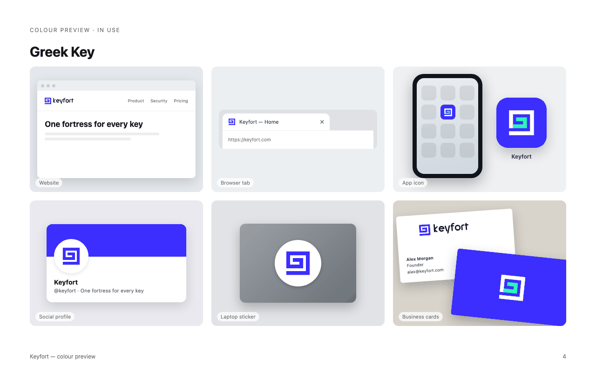

### Relaydesk — SaaS de atención al cliente
*Una bandeja de entrada compartida para correo, chat y redes sociales, con IA que redacta respuestas y asigna tickets: útil, rápido, humano. Sin auriculares con micrófono, robots ni globos de diálogo.*

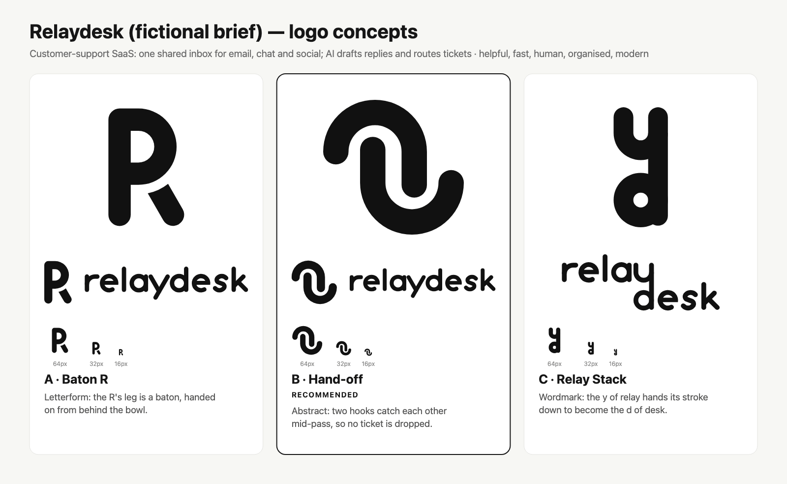

**Recomendado: Relevo** (*Hand-off* en la imagen) — dos ganchos idénticos se atrapan en pleno pase, para que ningún ticket se caiga: un solo radio y un solo trazo, repetidos con un giro de 180°. El coral solo llega a 2.1 : 1 sobre violeta, así que en superficies violetas el símbolo pasa a ser todo blanco. En la pasada de oficio se ajustó la *y* a 60° exactos y se abrió el hueco de un gancho que se había reducido a 1.7 unidades.

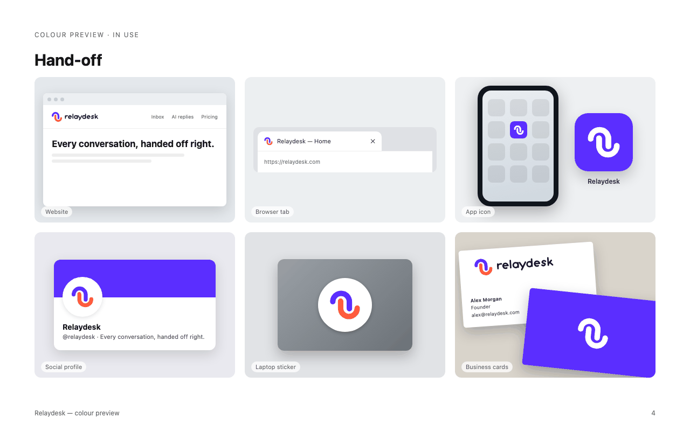

### Tracelane — analítica de producto
*Seguimiento de eventos, embudos y recorridos de sesión para desarrolladores, con SDK y CLI: preciso, rápido, revelador. Sin gráficos de barras, gráficos circulares, lupas ni flechas hacia arriba.*

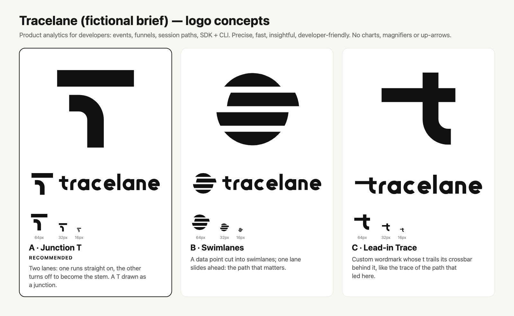

**Recomendado: Desvío** (*Junction T* en la imagen) — un carril sigue recto y el otro gira para convertirse en el fuste: el momento que mide un embudo, dibujado como la inicial de la marca. Verde ácido sobre carbón para la terminal y el README, con el carril que gira siempre en rosa señal. Al mover ese carril hacia dentro, la T se empezó a leer a primera vista.

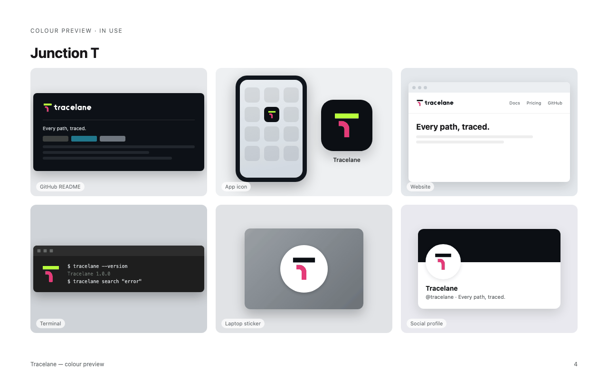

### Tallybook — facturación y contabilidad
*Facturación y contabilidad para pequeños negocios y trabajadores independientes: amigable, ordenado, tranquilizador. Sin calculadoras, monedas, libros contables ni gráficos.*

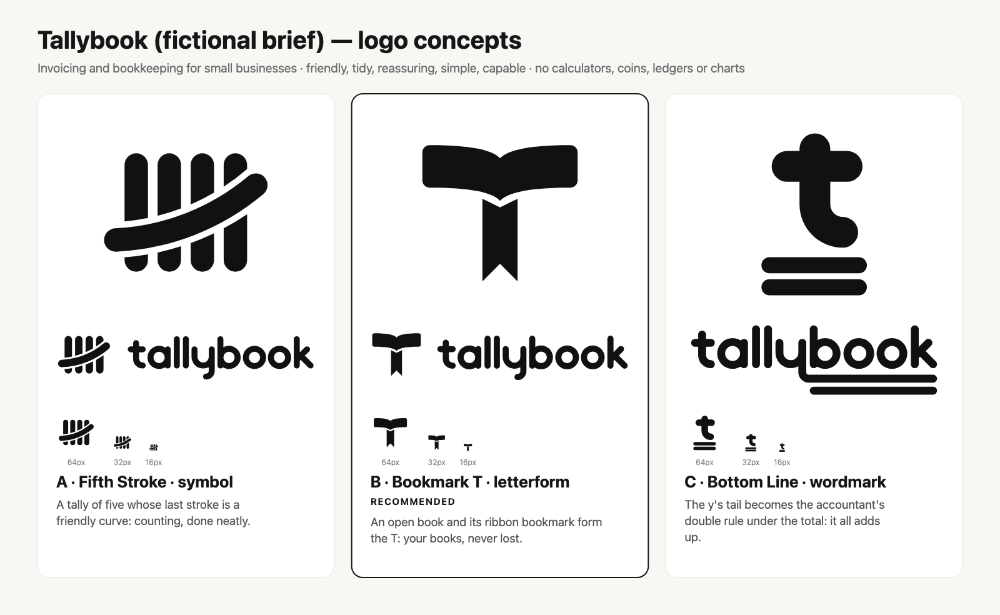

**Recomendado: Cinta** (*Bookmark T* en la imagen) — un libro abierto forma el travesaño y su cinta separadora forma el fuste: tus libros contables, siempre abiertos en la página correcta. Mandarina con una cinta verde laguna; sobre superficies mandarina la cinta pasa al color tinta, porque el verde azulado y el mandarina tienen casi la misma luminancia y vibrarían.

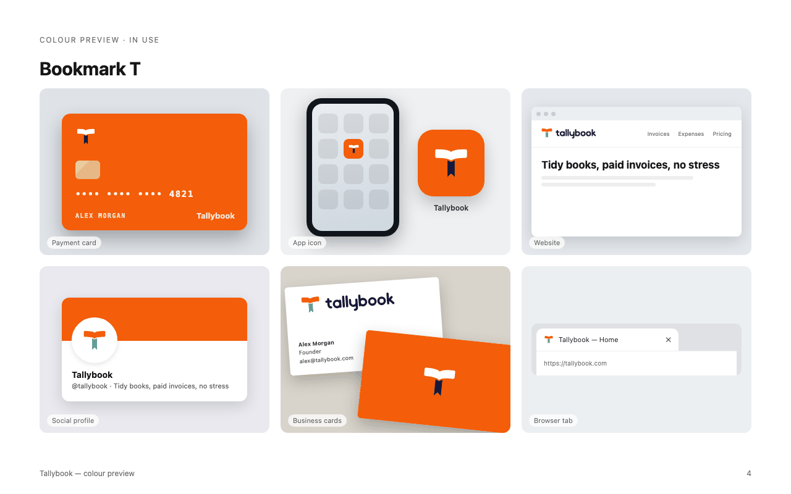

### Northvault — banco digital para freelancers
*Una cuenta empresarial con apartados para impuestos que se llenan solos y facturación al instante: segura de sí, clara, independiente. Sin azul de banco, monedas, alcancías, columnas ni flechas hacia arriba.*

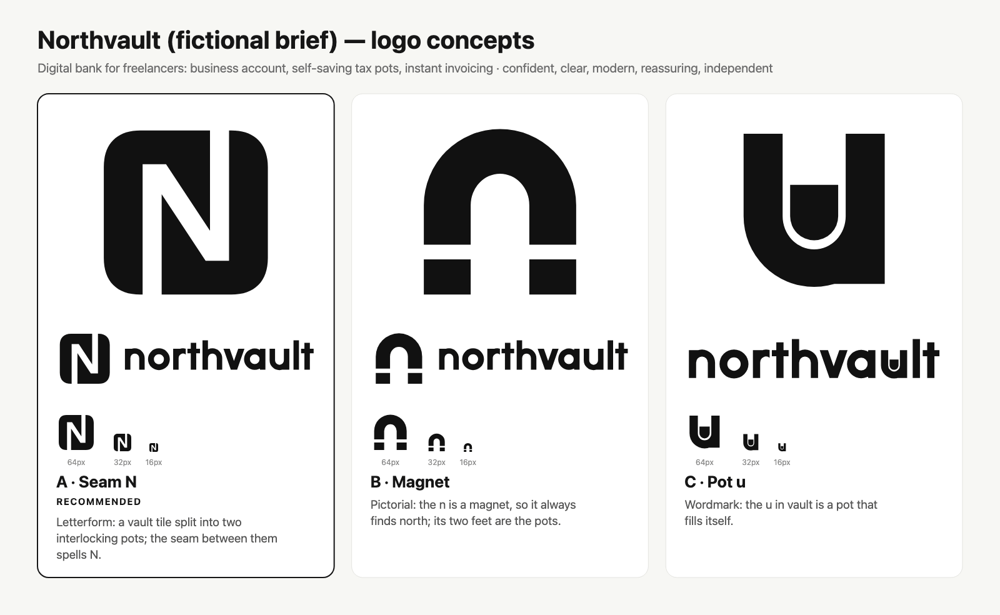

**Recomendado: Costura** (*Seam N* en la imagen) — una placa con forma de bóveda dividida en dos apartados que encajan entre sí; la costura entre ambos traza una N (y la N marca el norte en toda brújula). Magenta intenso, con verde eléctrico reservado solo para superficies oscuras. Se probó una tarjeta verde eléctrico y se descartó porque el texto sobre ella no pasaba la prueba de contraste.

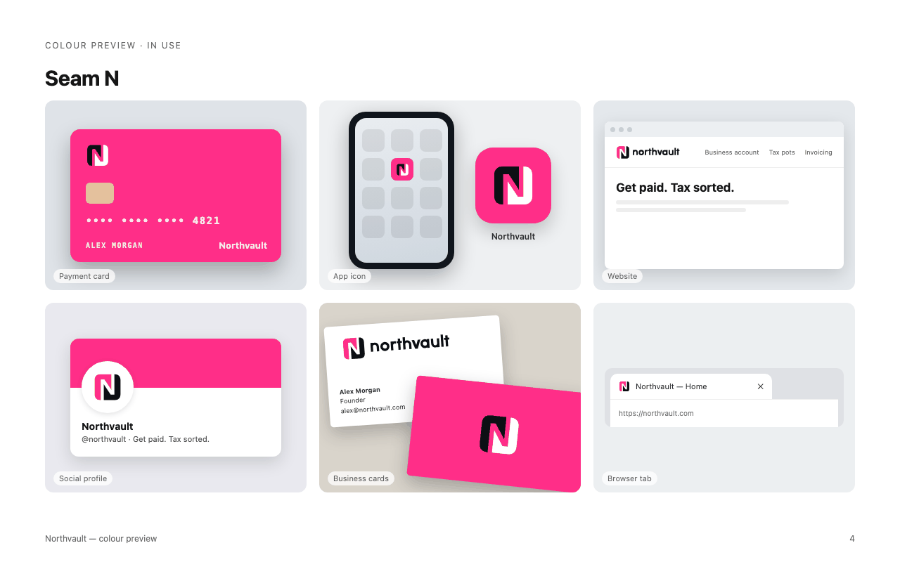

### Mediora — app de telemedicina
*Videoconsultas con un médico en minutos, recetas electrónicas e historial clínico en un solo lugar: cercana, inmediata, cálida. Sin cruces, estetoscopios, corazones ni líneas de pulso.*

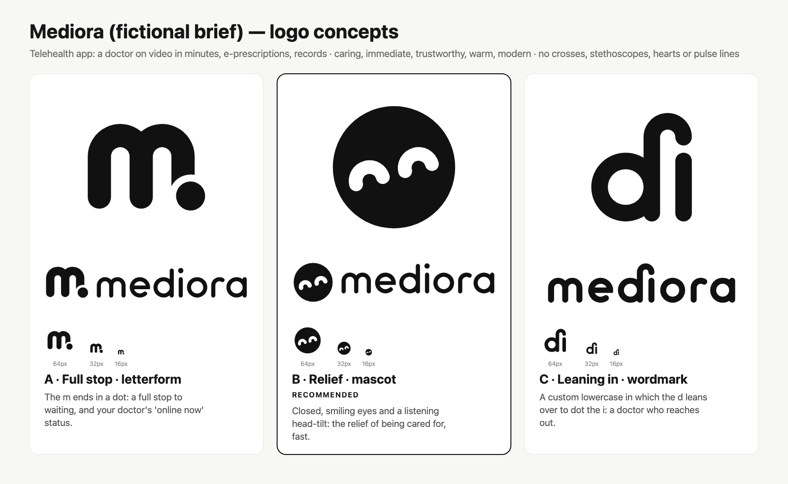

**Recomendado: Alivio** (*Relief* en la imagen) — una cara circular con los ojos cerrados y sonrientes, y la cabeza inclinada como quien escucha: el alivio de sentirse atendido, y rápido. Una cara coral sobre un fondo verde azulado, con ojos y logotipo en color tinta. Un primer concepto de *m* ponía su punto arriba a la derecha, donde se leía "mi", así que el punto bajó.

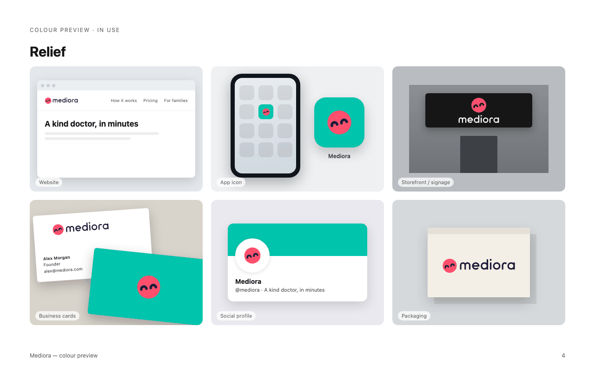

### Brightdose — farmacia en línea
*Recetas recurrentes entregadas en tu puerta, con recordatorios y chat con farmacéuticos: alegre, confiable, sencilla. Sin cruces verdes, pastillas, morteros ni la vara de Asclepio.*

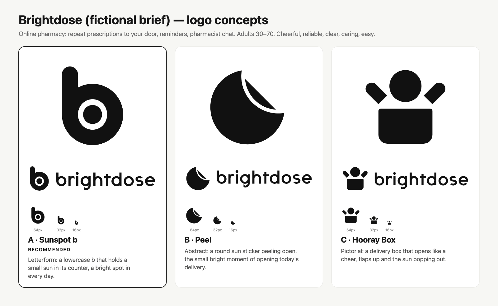

**Recomendado: Destello** (*Sunspot b* en la imagen) — una *b* minúscula que guarda un pequeño sol en su contraforma: un punto luminoso en cada día. El amarillo amanecer es raro en un sector de verdes y azules; en bolsas amarillas y en el ícono de la app, el símbolo completo pasa a cobalto a una tinta. Descartados en el camino: un sol de siete rayos que parecía un casco y una cáscara que parecía una luna.

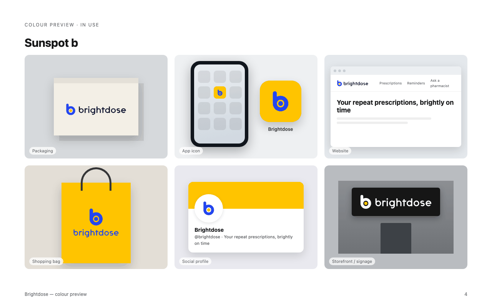

---

## Qué detectan las pruebas

Cada concepto pasa por `svg_audit.py` y `preview_sheet.py` antes del punto de control. La hoja de pruebas pone las
opciones lado a lado a 96 y 32 px, a una tinta y en versión invertida, y luego baja cada una por una escalera de
tamaños hasta 16 px. Aquí muestra por qué el logotipo de Maison Orvelle (B) necesita un símbolo que lo acompañe,
mientras que el monograma (A) resiste:


La auditoría convierte las reglas del oficio en comprobaciones. Una misma ejecución con dos archivos: la composición
recomendada y el emblema que no se recomendó:

```text
$ python3 scripts/svg_audit.py a-composicion.svg b-emblema.svg

=== a-composicion.svg
viewBox 0 0 905 256 · proporción 3.535 (horizontal) · colores 1 · puntos de anclaje 205
· INFO [complexity] 205 puntos de anclaje (mediana de la biblioteca 75, p75 155). Comprueba que cada punto se justifique.
puntaje de listo para producción: 99/100

=== b-emblema.svg
viewBox 0 0 256 256 · proporción 1.0 (square) · colores 1 · puntos de anclaje 374
▲ WARN [complex] 374 puntos de anclaje: más que el 95 % de los logos de referencia comparables (mediana 53).
▲ WARN [near-miss-angle] 8 borde(s) recto(s) a 0.3–3° de un ángulo limpio … (esperable en texto compuesto sobre una curva)
▲ WARN [tiny-detail] 6 subforma(s) más pequeña(s) que 1/48 del lienzo: 4.3×3.1 en (40,77) …
puntaje de listo para producción: 76/100
```

---

## Instalación

Este fork vive en [crisio/logo-design-skill](https://github.com/crisio/logo-design-skill) y la skill está en la
carpeta `skills/marca`.

### Claude Code: marketplace de plugins (recomendado)
```
/plugin marketplace add crisio/logo-design-skill
/plugin install marca@logo-design-skill
```

### Claude Code y Codex CLI: manual
Clona el repo y corre `./install.sh`. El script copia la skill a `~/.claude/skills/marca` (Claude Code, para todos tus
proyectos) y a `~/.codex/skills/marca` (Codex CLI):
```bash
git clone https://github.com/crisio/logo-design-skill.git
cd logo-design-skill
./install.sh
```
Como copia los archivos (no los enlaza), vuelve a correr `./install.sh` cada vez que edites algo en `skills/marca`.
Si antes instalaste la versión original (carpeta `logo-design`), el script la borra para que no queden dos skills
iguales. Para usarla en un solo proyecto, copia la carpeta a mano dentro de ese proyecto:
```bash
cp -r skills/marca /ruta/a/tu-proyecto/.claude/skills/marca     # por proyecto
```

### Claude.ai / Claude Desktop
Descarga `marca.zip` de la página de [Releases](https://github.com/crisio/logo-design-skill/releases) del fork (si hay
una versión publicada) o genéralo con `python3 tools/package_skill.py` (queda en `dist/`), y súbelo en **Settings →
Capabilities → Skills** (Configuración → Capacidades → Skills). Si tu carga tiene un límite de tamaño, usa
`marca-lite.zip` (todo menos los archivos SVG de la biblioteca).

### Gemini CLI, Codex CLI y otros agentes
La skill usa el formato abierto **Agent Skills** (una carpeta con un `SKILL.md`), así que funciona en cualquier agente
compatible con skills: las instrucciones son Markdown y las herramientas son Python, sin más. Clona el repo una vez y
copia la carpeta al directorio de skills de tu agente:
```bash
git clone https://github.com/crisio/logo-design-skill.git
```

| Agente | Personal (todos los proyectos) | Por proyecto |
|---|---|---|
| Gemini CLI | `~/.gemini/skills/marca` (o `~/.agents/skills/`) | `.gemini/skills/marca` |
| Codex CLI | `~/.codex/skills/marca` (lo hace `./install.sh`) | `.codex/skills/marca` |
| Cursor, GitHub Copilot, OpenCode y otros | consulta la documentación de skills de tu agente | normalmente una carpeta `skills/` en el proyecto |

```bash
cp -r logo-design-skill/skills/marca ~/.gemini/skills/marca     # Gemini CLI
cp -r logo-design-skill/skills/marca ~/.codex/skills/marca      # Codex CLI
```
Abre una sesión nueva y pide un logo: el agente reconoce la skill por su descripción. Funciona mejor con un modelo que
pueda ver imágenes, porque renderiza sus propios borradores a PNG y los revisa antes de mostrarte nada. La carpeta
`.claude-plugin/` solo la usa Claude Code; los demás agentes la ignoran.

### Actualizaciones del proyecto original
Para traer las novedades de [kaankiziltug/logo-design-skill](https://github.com/kaankiziltug/logo-design-skill),
agrega el original como `upstream` (solo la primera vez) y haz pull:
```bash
git remote add upstream https://github.com/kaankiziltug/logo-design-skill.git   # solo la primera vez
git pull upstream main
```
Como casi todos los archivos están traducidos, espera conflictos en ellos: resuélvelos conservando el texto en español
e incorporando los cambios de contenido del original. Cuando termines, vuelve a correr `./install.sh`.

## Uso

Solo pídelo: la skill se activa con pedidos de logo, logotipo, monograma, marca gráfica, ícono de app, favicon,
rediseño o crítica:

> *"Diseña un logo para **Puerto**, una app de ahorro para quienes ahorran por primera vez. Tiene que transmitir calma y seguridad."*
> *"Este es nuestro logo actual (logo.svg): critícalo y propón una renovación."*
> *"Dame tres direcciones de logotipo para un tostador de café de especialidad llamado Kiln."*
> *"Convierte este símbolo en favicon, ícono de app y versiones a una tinta, y agrega una guía de uso de una página."*

También puedes correr las herramientas directamente:
```bash
cd skills/marca
python3 scripts/search_library.py --technique negative-space --exemplary
python3 scripts/search_library.py --industry payments-fintech --summary
python3 scripts/svg_audit.py mi-logo.svg
python3 scripts/concept_sheet.py a.svg b.svg c.svg --names "A" "B" "C" --recommend 1 -o conceptos.png
python3 scripts/preview_sheet.py mi-logo.svg --refs-industry developer-tools -o pruebas.html
python3 scripts/render_png.py mi-logo.svg --size 512 -o mi-logo.png
python3 scripts/export_variants.py mi-logo.svg --title "Logo de Puerto" --mono "#0F7C80" --icon-bg "#0F7C80" --web-icons
open assets/library/gallery.html      # explora la biblioteca de forma visual
```
Requiere Python 3.8 o superior (solo la biblioteca estándar). Para exportar PNG e ICO usa el renderizador que haya
disponible: `cairosvg`, `rsvg-convert`, Inkscape, un navegador basado en Chromium (Chrome, Edge, Brave) o Quick Look
de macOS.

### Darles identidad a varios agentes o proyectos
Si quieres crear la marca de varios agentes o proyectos, usa el cuestionario
[`skills/marca/templates/cuestionario-para-agentes.md`](skills/marca/templates/cuestionario-para-agentes.md). Pégalo
en la sesión de Claude Code de cada agente o proyecto: esa sesión revisa su propio código y responde con una **Ficha de
marca**. Luego trae cada ficha a tu sesión de diseño y úsala como brief.

### Kots: las mascotas animadas de los agentes
Cada personaje 3D se convierte en un **Kot**: la mascota de peluche del agente, viva en la web (flota, respira,
parpadea y reacciona al cursor) con el componente sin dependencias `<kot-avatar>`, más un WebP animado con
transparencia y un **sticker animado de Telegram**. Todo sale de un comando:

```bash
python3 skills/marca/scripts/kot_build.py --nombre Hilo --personaje hilo-personaje.png \
    --color "#1B9E73" --fondo "#E9F6F1" --salida marcas/hilo/kot --familia marcas/kots
```
Guía completa: [`skills/marca/references/kots.md`](skills/marca/references/kots.md). Para la animación usa ffmpeg,
img2webp y Chrome si están instalados.

### Personaje 3D de cada agente
Con el logo aprobado, la skill puede convertirlo en el **personaje 3D** del agente: una mascota minimalista y táctil
(fieltro, peluche de pelo corto, arcilla suave o goma mate), con dos ojos pequeños, los colores de la marca y fondo
transparente, inspirada en el lenguaje visual «dots» de OpenAI sin copiar ningún personaje existente. Necesita una
herramienta de generación de imágenes en tu entorno; si no hay, entrega el prompt listo. La regla completa está en
[`skills/marca/references/personaje-3d.md`](skills/marca/references/personaje-3d.md) y el resultado se revisa con
`scripts/check_alpha.py`, que detecta fondos pintados y tableros de ajedrez falsos.

## Qué incluye

```
skills/marca/
├── SKILL.md                     # flujo de trabajo, punto de control, principios, señales de alerta, guía de herramientas
├── references/                  # se cargan solo cuando hacen falta
│   ├── principles.md            # los doce principios, modelo mnemotécnico, simplicidad, pertinencia, longevidad
│   ├── discovery-brief.md       # banco de preguntas, plantilla de brief, mapa de palabras
│   ├── mark-types.md            # del logotipo al imagotipo: ventajas, desventajas, guía para decidir
│   ├── visual-techniques.md     # geometría, retículas, equilibrio, correcciones ópticas, espacio negativo, degradados…
│   ├── color.md · typography.md · process.md · svg-construction.md
│   ├── testing-checklist.md · presentation-delivery.md · identity-system.md
│   ├── redesign.md · critique.md
│   ├── personaje-3d.md          # regla para convertir el logo en el personaje 3D (avatar) del agente
│   ├── kots.md                  # Kots: la mascota animada de cada agente (web, Telegram, sticker)
│   └── library-guide.md         # contenido de la biblioteca, datos clave, ejemplos seleccionados por técnica
├── scripts/
│   ├── concept_sheet.py         # hoja de conceptos en una sola imagen, la que se muestra en el punto de control
│   ├── search_library.py        # consulta la biblioteca de más de 1400 logos (filtros, --summary, --format paths)
│   ├── svg_audit.py             # estructura, colores, complejidad, ángulos casi exactos, detalles diminutos, centrado
│   ├── preview_sheet.py         # hoja de pruebas HTML (tamaños, fondos, tratamientos, contextos, prueba de estantería)
│   ├── presentation_board.py    # presentación al cliente con seis mockups por concepto, propios de cada industria
│   ├── render_png.py            # SVG → PNG transparente a tamaños exactos, favicon.ico
│   ├── export_variants.py       # negro / blanco / a una tinta / cuadrado / favicon / ícono de app, PNG, set web completo
│   ├── check_alpha.py           # revisa que un PNG tenga fondo transparente de verdad (avatares y personajes 3D)
│   ├── eye_highlight.py         # agrega el brillo de la familia a los ojos de un personaje 3D
│   ├── kot_build.py             # arma el kit de un Kot: tamaños, Telegram, WebP animado, sticker, web y familia
│   └── build_catalog.py         # para mantenedores: reconstruye el catálogo, las estadísticas y la galería
├── templates/                   # plantilla de guía de marca, ejemplo de spec de presentación, cuestionario para agentes
├── assets/kots/                 # kot-avatar.js: componente web de los Kots, sin dependencias
└── assets/library/              # svg/ (más de 1400 archivos), catalog.json, classifications.json, stats.json, gallery.html
```

## La biblioteca en cifras

Más de 1400 archivos · ≈1200 marcas · 233 marcas con composición y además un ícono independiente · tipos de logo:
símbolo abstracto 24 %, imagotipo 21 %, símbolo pictórico 20 %, letra-símbolo 15 %, logotipo 10 %, emblema 4 %,
mascota 4 %, sigla 3 % · mediana de 2 colores, el 75 % usa ≤ 3 · degradados en el 19 % · 141 marcados como ejemplos
didácticos destacados. Más detalles en [`references/library-guide.md`](skills/marca/references/library-guide.md).

## Licencia y marcas registradas

Texto de la skill, scripts, plantillas y datos del catálogo: [MIT](LICENSE), igual que el
[proyecto original](https://github.com/kaankiziltug/logo-design-skill) de @kaankiziltug. Los archivos de logos en `assets/library/svg/` son
marcas registradas de sus respectivos dueños, se incluyen solo como referencia y con fines educativos, y **no** están
cubiertos por la licencia MIT: consulta [TRADEMARKS.md](TRADEMARKS.md). Las marcas de los ejemplos son briefs ficticios
creados para demostrar la skill.

Las mejoras de fondo (nuevos logos clasificados con derechos de redistribución, mejores scripts, evals) conviene
proponerlas en el [repositorio original](https://github.com/kaankiziltug/logo-design-skill). En este fork son
bienvenidas las correcciones y mejoras de la traducción.
